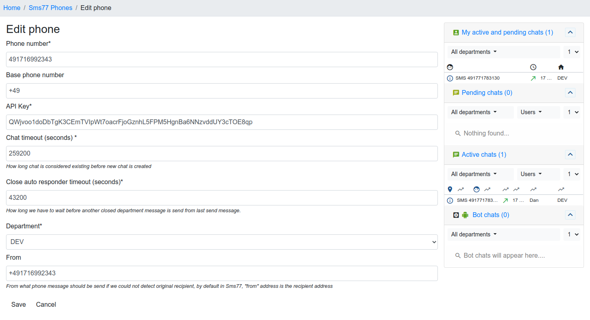
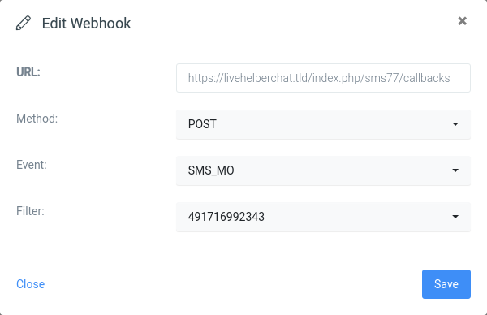

# Installation

1. Extract archive into `extension` folder
2. Install dependencies: `cd seven && composer update`
3. Copy `extension/seven/settings.ini.default.php` to `extension/seven/settings.ini.php`
4. Create SQL structure

   run in console `php cron.php -s site_admin -e seven -c cron/update_structure`

   or load [SQL file](doc/install.sql)
5. Add extension in `settings/settings.ini.php`: `'extensions' => ['seven'],`
6. Clean cache via `Home->System configuration->Clean cache`
7. The module can now be accessed under `Modules` in the left pane
8. Add a phone from Live Helper Chat back office like
   
9. Go to your seven Dashboard to create a
   webhook 

A callback URL gets shown once you register a phone in back office. It can be used for
inbound messaging.

## Dispatched Events

- chat.chat_started
- chat.messages_added_passive
- chat.nodjshelper_notify_delay
- chat.restart_chat
- chat.unread_chat
- chat.web_add_msg_admin
- seven.process_callback
- seven.send_sms_user
- seven.sms_received
- seven.sms_send_to_user
- telegram.get_signature

###### Support

Need help? Feel free to [contact us](https://www.seven.io/en/company/contact/).

