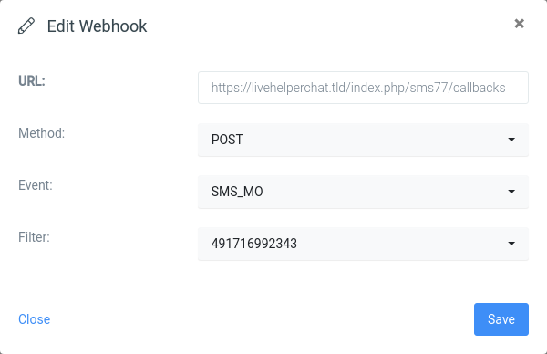

# Installation

1. Extract archive into `extension` folder
2. Install dependencies: `cd sms77 && composer update`
3. Copy `extension/sms77/settings.ini.default.php` to `extension/sms77/settings.ini.php`
4. Create SQL structure

   run in console `php cron.php -s site_admin -e sms77 -c cron/update_structure`

   or load [SQL file](doc/install.sql)
5. Add extension in `settings/settings.ini.php`: `'extensions' => ['sms77'],`
6. Clean cache via `Home->System configuration->Clean cache`
7. The module can now be accessed under `Modules` in the left pane
8. Add a phone from Live Helper Chat back office like
   
9. Go to your Sms77 Dashboard to create a
   webhook 

A callback URL gets shown once you register a phone in back office. It can be used for
inbound messaging.

## Dispatched Events

- chat.chat_started
- chat.messages_added_passive
- chat.nodjshelper_notify_delay
- chat.restart_chat
- chat.unread_chat
- chat.web_add_msg_admin
- sms77.process_callback
- sms77.send_sms_user
- sms77.sms_received
- sms77.sms_send_to_user
- telegram.get_signature

###### Support

Need help? Feel free to [contact us](https://www.sms77.io/en/company/contact/).

