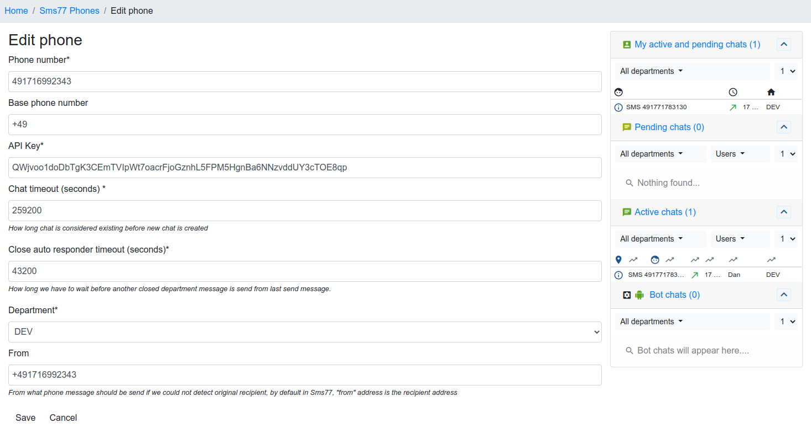
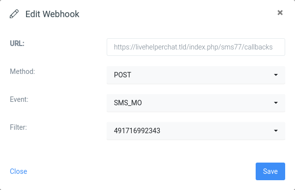

<p align="center">
  
</p>

<h1 align="center">seven SMS for Live Helper Chat</h1>

<p align="center">
  Two-way SMS messaging for <a href="https://livehelperchat.com/">Live Helper Chat</a> via the seven gateway. Operators can SMS visitors and inbound messages turn into chats.
</p>

<p align="center">
  <a href="LICENSE"></a>
  
  
</p>

---

## Features

- **Outbound SMS** - Operators message visitors directly from the LHC back office
- **Inbound SMS** - Incoming messages spawn LHC chats via webhook
- **Multi-Phone Support** - Register multiple phone numbers, each with its own callback URL
- **Event Hooks** - Dispatched events let you wire into operator notification flows

## Prerequisites

- [Live Helper Chat](https://livehelperchat.com/) installation
- PHP 7.4+ with Composer
- A [seven account](https://www.seven.io/) with API key ([How to get your API key](https://help.seven.io/en/developer/where-do-i-find-my-api-key))

## Installation

1. Extract the [latest release](https://github.com/seven-io/livehelperchat/releases/latest) into the LHC `extension` folder.
2. Install dependencies:

   ```bash
   cd extension/seven
   composer update
   ```

3. Copy the default settings file:

   ```bash
   cp settings.ini.default.php settings.ini.php
   ```

4. Create the database structure - either via console:

   ```bash
   php cron.php -s site_admin -e seven -c cron/update_structure
   ```

   or by importing [`doc/install.sql`](doc/install.sql) manually.

5. Enable the extension in `settings/settings.ini.php`:

   ```ini
   extensions[] = seven
   ```

6. Clean the LHC cache via **Home > System configuration > Clean cache**.

The seven module is now reachable from the **Modules** menu.

## Configuration

### Register a phone number

Add a phone number in the LHC back office:



LHC will display a callback URL once the number is registered.

### Wire the inbound webhook at seven

In the seven [dashboard](https://app.seven.io/) under *Developer > Webhooks*, register a webhook pointing at the LHC callback URL:



## Dispatched Events

| Event | Trigger |
|-------|---------|
| `chat.chat_started` | New chat created |
| `chat.messages_added_passive` | Message added without operator action |
| `chat.nodjshelper_notify_delay` | Delayed notification fired |
| `chat.restart_chat` | Chat restarted |
| `chat.unread_chat` | Unread chat detected |
| `chat.web_add_msg_admin` | Admin adds a message via web UI |
| `seven.process_callback` | Inbound seven webhook processed |
| `seven.send_sms_user` | SMS sent to user |
| `seven.sms_received` | Inbound SMS received |
| `seven.sms_send_to_user` | Reply SMS sent to chat user |
| `telegram.get_signature` | Telegram signature shared (for hybrid setups) |

## Support

Need help? Feel free to [contact us](https://www.seven.io/en/company/contact/) or [open an issue](https://github.com/seven-io/livehelperchat/issues).

## License

[MIT](LICENSE)
